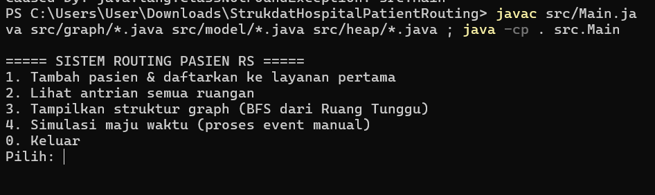

# STRUKDAT

----
### Run code

- masuk folder run
```powershell
javac src/Main.java src/graph/*.java src/model/*.java src/heap/*.java ; java -cp . src.Main
```

### Penjelasan : 
Sistem untuk antrian data di sebuah rumah sakit , jadi kita misalkan untuk node nya adalah tempat seperti poli , lab , apotek , dll . Terus kita bikin sestem menggunakna `bfs` dan `dijkstra`. `bfs` gunanya itu mencari node lainnya berdasarkan levelnya terus buat `dijkstra` itu untuk menentukan ruangan mana yang paling cepat dimasuki. Tiap edge merepresentasikan waktu  antar ruangan  lalu untuk tiap node ada antrian nya. Ada keadaan khusus ketika ada pasien gawat darurat setelah masuk igd ia bisa menyerobot orang yang antri di ruangan selanjutnya (contoh poli jantung).


terus buat orang yang diserobot kita lakukan reschedul antrian , jadi setelah orang darurat masuk kan otomatis si orang yang diserobot harus pindah setelah orang darurat maka kita lakukan reschedule.

 lalu ada sistem ` refresh(waktuSekarang());`

```java
    static void refresh(int now) {
        while (!eventQueue.isEmpty() && eventQueue.peek().waktuSelesai <= now) {
            Event ev = eventQueue.poll();

            if (!ev.valid) {
                // Event ini sudah dibatalkan (pasien kena reschedule akibat darurat)
                System.out.println("[SKIP t=" + now + "] Event lama " + ev.pasien.nama
                        + " di ruangan #" + ev.ruanganId + " diabaikan (sudah di-reschedule).");
                continue;
            }

            Ruangan r = graph.nodes.get(ev.ruanganId);
            Pasien p = ev.pasien;

            // Pasien selesai dilayani → kosongkan slot "sedang dilayani"
            if (r.pasienSedangDilayani != null && r.pasienSedangDilayani.id == p.id) {
                r.pasienSedangDilayani = null;
            }

            // Keluarkan pasien dari heap antrian ruangan ini
            keluarkanDariAntrian(r, p);

            System.out.println("\n[EVENT t=" + now + "] " + p.nama
                    + " selesai di " + r.nama + ".");

            // Tandai pasien tidak punya event aktif lagi
            p.eventAktif = null;

            // Maju ke tahap SOP berikutnya
            p.tahapSaatIni++;
            prosesNextTahap(p, now);
        }
    }
```

fungsi nya buat merefresh , kan ketika semisal ada user 1 masuk ke poli jantung lalu kita tambahkan user 2 dan ingin masuk poli jantung juga, kita perlu update dulu apakah untuk si user 1 sudah selesai dicek belum , jika sudah si user 1 lanjut ke sop selanjutnya dan cari ruangan tercepat lagi dengan `dijkstra`